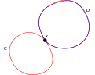

# Isomorphism

## Proposition
Let $f$ be a continuous function, such that for any real numbers $a$, $b$, $f(a + b) = f(a)f(b)$.
Then, $f(x) \geq 0$ for any $x\in\mathbb{R}$.

## Proof
By way of contradiction, suppose $f(x) < 0$ for some $x\in\mathbb{R}$.
Then, $f(x) = f(x + 0) = f(x)f(0)$. This implies $f(0) = 1$.
Since $f$ is continuous, $f(c) = 0$ for some $c$ between $x$ and $0$
by the intermediate value theorem. Then, $f(x) = f(x - c + c) = f(x - c)f(c) = 0$
is a contradiction. Hence, $f(x)\geq 0$ can never be negative.

# Limits

## Proposition
Let $\{x_n\}$ and $\{y_n\}$ be convergent sequences,
such that $x_n < y_n$ for any $n\in\mathbb{N}$.
Then, $\lim_{n\to\infty} x_n \leq \lim_{n\to\infty} y_n$.

## Proof
Let $\{x_n\}$, $\{y_n\}$ be sequences,
such that $x_n\to x$ and $y_n\to y$. Let $\epsilon > 0$.
For any $n$ large enough, we have $|x_n - x| < \frac{\epsilon}{2}$ and $|y_n - y| <\frac{\epsilon}{2}$. Then,

$$\begin{aligned}
    x_n - y &< y_n - y \leq \frac{\epsilon}{2} \\
    x_n - x &< y - x + \frac{\epsilon}{2} \\
    -\frac{\epsilon}{2} &< y - x + \frac{\epsilon}{2} \\
    x - y &< \epsilon.
\end{aligned}$$

Since $\epsilon > 0$ is arbitrary, $x - y \leq 0$, so $x \leq y$.

# Happy Number

A happy number `n` is defined by the process:

* Replaced `n` with the sum of squares of its digits
* If this process converges to 1, then it is a happy number
* If this process loops in a cycle, then it is not a happy number

## Example
```
19
1^2 + 9^2 = 82
8^2 + 2^2 = 68
6^2 + 8^2 = 100
1^2 + 0^2 + 0^2 = 1

2
2^2 = 4
4^2 = 16
1^2 + 6^2 = 37
3^2 + 7^2 = 58
5^2 + 8^2 = 89
8^2 + 9^2 = 64 + 81 = 145
1^2 + 4^2 + 5^2 = 1 + 16 + 25 = 42
4^2 + 2^2 = 16 + 4 = 20
2^2 + 0^2 = 4
```

The following function verifies if a number is happy:
```python
def is_happy(num: int):
    visited = Set()

    def _is_happy(num: int):
        if num == 1:
            return True
        if num in visited:
            return False
        return _is_happy(sum(int(c)**2 for c in str(num)))

    return _is_happy(num)
```

# Eulerian Graphs

## Proposition
A nontrivial connected graph is Eulerian iff every vertex has even degree.

## Proof
Let $G$ be a nontrivial connected graph whose vertices all have even degree.
Let $C$ be a maximal length trail in $G$.

**Claim**: $C$ is closed. If not, it has an endpoint $u$ with odd degree in $C$.
Since $u$ has even degree in $G$, there exists an edge $uv\in{E(G)}\setminus{E(C)}$.
But, $C + uv$ is a longer trail $\bot$.
So, trail of maximum length must be closed.

If $E(C) = E(G)$, then we're done.
BWOC, suppose not. Since $G$ is connected, there exists some $xy\in{G}$, where $x\in{V(C)}$.
Consider $G - E(C)$. Since $C$ is a circuit, all vertices have an even degree in $C$,
so they have even degree in $G - E(C)$.
Consider a maximal length trail $D$ starting at $xy\in{G - E(C)}$.
As before, $D$ is closed.
Splice $D$ into $G$ at $x$: $xCxDxCx$.
This is longer than $C$ $\bot$.


